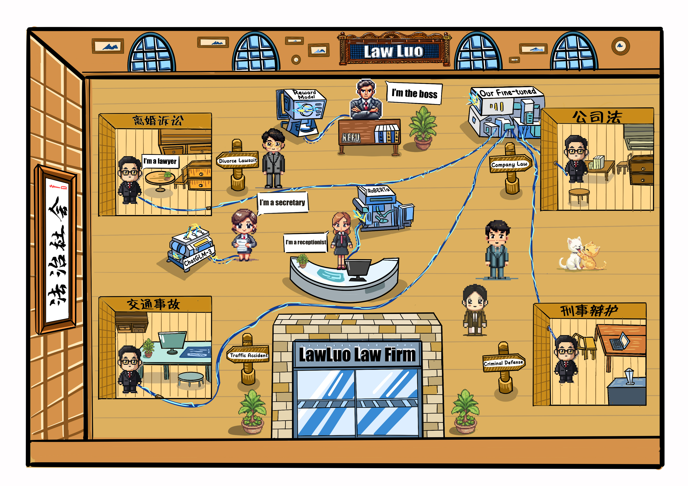

# 🏛️ LawLuo: A Chinese Law Firm Co-run by LLM  Agents

  
  <h4 style="text-align:center;">作者信息</h4>
  该项目主要贡献者包括 🚀: <strong>Jingyun Sun</strong>, <strong>Chengxiao Dai</strong>, <strong>Zhongze Luo</strong>, <strong>Yanbo Chang</strong>, <strong>Yang Li</strong>。 此外，特别感谢<strong>迪加视觉设计工作室</strong>和<strong>Yanbin Zou</strong>帮助我们绘制插图🎉。其中，Yang Li（李洋）为东北林业大学计算机与控制学院副院长，博士毕业于哈尔滨工业大学，师从哈工大刘挺教授，主要研究方向为自然语言处理、社会计算、大模型以及图网络等，是本项目的通讯作者。
    

<ul style="list-style-type:square;">
    <li>🌲Jingyun Sun, 东北林业大学计算机与控制工程学院</li>
    <li>🌟Chengxiao Dai, 马来西亚拉曼大学信息与通信技术学院</li>
    <li>🌲Zhongze Luo, 东北林业大学计算机与控制工程学院</li>
    <li>🌟Yanbo Chang, 石家庄铁道大学建筑与艺术设计学院</li>
    <li>🌲<strong>Yang Li</strong>，东北林业大学计算机与控制工程学院</li>
    <li>🌲Yanbin Zou, 东北林业大学管理学院</li>
    
</ul>

  

    
    
    
     
      
    <a href=""><strong>论文链接</strong></a>
  

# 1. 项目介绍

得益于优异的文本理解和生成能力，法律大语言模型（Large Language Models, LLMs）能够为不具有法律背景的用户提供法律咨询服务。然而，现有的中文法律LLM仅单个模型与用户进行对话，这与现实律师事务所中多个员工协作完成一次咨询之间存在差距，从而无法给用户带来真实的咨询体验。此外，现有的中文法律LLM还存在以下问题：

1. **缺乏对指令微调数据质量的把控** 📉
2. **用户粗糙而模糊的问句加重模型幻觉** 🤔
3. **多轮对话后的指令遵循能力下降** 🔄

因此，我们提出一个基于LLM多智能体协作的法律问答框架，称作 **LawLuo**。该框架包含接待员、律师、秘书以及老板四个智能体，分别负责不同的功能，共同完成一次用户的法律咨询。

#### LawLuo 框架的组成部分 🛠️

- **接待员** 🧑‍💼：负责初步接待用户并了解其基本需求
- **律师** 👨‍⚖️：提供具体的法律建议和解答用户的问题
- **秘书** 📝：记录和整理咨询过程中的关键信息
- **老板** 🧑‍💼：监督整个咨询过程，确保咨询质量

#### 数据集 📊

我们构建了高质量法律问答数据集 **KINLED** 和多轮法律咨询数据集 **MURLED**，并用这两个数据微调 **ChatGLM-3-6b**。

#### 实验结果 🧪

实验结果表明，**LawLuo** 在以下三个维度上的表现优于包括 GPT-4 在内的基线 LLM：

- **Lawyer-like language** 🗣️
- **法律建议的有用性** 📚
- **法律知识的准确性** 🎯

*LawLuo* 为用户带来了更加真实和专业的法律咨询体验。未来，我们将继续优化该框架，以期进一步提升法律咨询服务的质量和用户体验。 🌟

# 2 数据集

#### KINLED: Knowledge-Intensive Legal Dialogue Dataset 📚⚖️

我们构建了一个规模较小但质量较高的知识密集型对话数据集 (Knowledge-INtensive LEgal Dialogue)，称作 **KINLED**。以下是数据集的主要特点：

1. **筛选现有法律对话数据**：我们剔除掉了质量较差的数据，保留了质量较高的对话数据用于我们的指令微调。
2. **增强法律概念和术语的知识运用**：我们构建了法律概念和术语的解释对话数据。
3. **增强对重要罪名和法条的知识运用**：我们构建了司法解释和法律判决对话数据。

**KINLED数据集统计信息** 📊

| 组成                                  | 包含对话数 |
|----------------------------------------------|----------------------|
| 法律术语解释对话              | 3,125                |
| 法律判决对话                      | 533                  |
| 司法解释对话             | 4,382                |
| 基于法律依据的情景问答          | 3,026                |
| 多轮法律咨询对话      | 995                  |
| 司法考试对话                | 985                  |

#### MURLED: Multiple Rounds Legal Dialogue Dataset 🗂️

我们还从某律师事务所的3,260份脱敏的律师真实咨询多轮对话中构造了一个微调数据集，称作 **MURLED**。下图展示了MURLED中的一个多轮对话示例，可以看出其提问的清晰性和回答的专业性都很高。

# 3 实验分析

✨ 整体来看，**LawLuo** 全面超越了基线。此外，从图中可以看出，LawLuo 对 ChatGLM-3-6b 取得了 **72% 的赢率**，鉴于 LawLuo 是在 ChatGLM-3-6b 上微调的，因此这证明了我们指令微调过程的有效性。🎉

📊 从图中可以看出，LawLuo 比另外两个主流的法律大模型 **LawGPT** 和 **LawyerLLaMa** 效果更好。

💪 最后，从图中可以看出即使与 **GPT-4** 相比，LawLuo 仍然具有显著优势。

🔄 随着对话轮次的增加，LawLuo 所生成的回答仍然保持较高的分数，如下图所示。

## 4 运行环境

#### 硬件配置 🖥️

- **GPU**: A100-40GB 🚀
- **CPU**: Intel(R) Xeon(R) Gold 6230R CPU 🧠

#### 软件环境 ⚙️

- **操作系统**: Ubuntu 20.04.6 LTS + GNU/Linux 5.4.0-147-generic x86_64 🐧
- **编程语言**: Python 3.11.8 🐍
- **深度学习框架**: Pytorch 2.3.0 🔥
- **CUDA**: 12.1 🚀
- **Transformers**: 4.40.0 🤖

## 5. 免责声明

1. 本项目中的所有内容与资源**仅限于学术研究用途，严禁应用于任何商业以及其他可能危害社会或造成不良影响的用途**。
2. 本项目中的法律术语及其概念数据来自**中文法律术语汇编**，网址：https://terms.legalhub.cn
3. 本项目中的法律问答数据集由**Kimi**和**ChatGPT**生成，**未经法律权威或专业人士严格验证，可能会存在些许错误内容，请诸位在使用时仔细判断与甄别，严禁应用于真实的法律相关用途或其他用途**。
4. 本项目**不承担任何法律责任**。

### 权重文件
#### 一次微调的权重文件 //由于文件过大，请直接使用OSS下载，具体操作方式如下
1. 下载OSS至Windows操作系统，详细下载链接请见：https://gpushare.com/docs/data/download/
2. 登录OSS //oss login 
3. 账号：18965335880  // Paswd：20021226#Dcx
4. 执行命令： oss cp oss://Lora_Output.zip /Path/to/you/pc
5. Lora 代码也在里面，如需要请执行命令： oss cp oss://ChatGLM3/ChatGLM3.zip /Path/to/you/pc
6. 配置文件请见 Lora参数.txt
